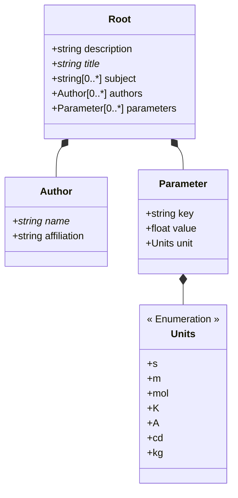

```mermaid
classDiagram
    Root *-- Author
    Root *-- Parameter
    Parameter *-- Units
    
    class Root {
        +string description
        +string title*
        +string[0..*] subject
        +Author[0..*] authors
        +Parameter[0..*] parameters
    }
    
    class Author {
        +string name*
        +string affiliation
    }
    
    class Parameter {
        +string key
        +float value
        +Units unit
    }
    
    class Units {
        << Enumeration >>
        +s
        +m
        +mol
        +K
        +A
        +cd
        +kg
    }
    
```